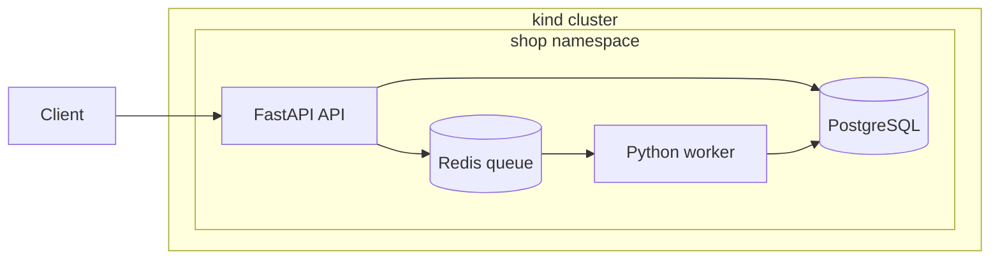

# kube-foundry

A small Kubernetes platform I'm building on top of kind.

The app is intentionally simple: a FastAPI service, a worker, PostgreSQL, Redis, and a tiny web frontend. The interesting part is everything around it: cluster networking, persistence, probes, policies, packaging, observability, and eventually GitOps.

It's still under construction. I keep adding one layer at a time and try to leave the cluster working after each change.

## What's running now

- A three-node kind cluster with Cilium
- FastAPI endpoints for items and background jobs
- A Redis queue and Python worker
- PostgreSQL and Redis with persistent volumes
- Startup, liveness, and dependency-aware readiness probes
- Default-deny network policies with explicit API/worker data paths
- Multi-stage, non-root containers with pinned versions
- A few smoke and failure tests so I can tell when I break something



The frontend exists but isn't wired into cluster traffic yet. That's part of the next batch of changes.

## Run it

You'll need Docker, kind 0.33.0, kubectl, Helm 3.22.0, GNU Make, and `curl`. On Windows, run the Make targets from WSL or Git Bash.

```bash
cp .env.example .env
# replace the placeholder passwords in .env

make cluster
make build
make load
make deploy-phase3
make smoke
make status
```

Clean it up with:

```bash
make cluster-delete
```

`.env`, rendered Secrets, tokens, and kubeconfigs do not belong in Git.

## Things I've tested so far

- Item CRUD works through the API
- Jobs make it through Redis and complete in the worker
- PostgreSQL data survives deleting and recreating its Pod
- The API goes unready when its dependencies fail
- An unlabeled Pod can't connect to PostgreSQL through the default-deny policies
- The Kubernetes manifests pass strict 1.37 schema validation

The exact commands and failure notes are in [docs/failures.md](docs/failures.md). Architecture notes and tradeoffs are in [docs/architecture.md](docs/architecture.md) and [docs/decisions.md](docs/decisions.md).

## Roadmap

- Gateway API and Envoy Gateway
- Local TLS with cert-manager
- Turning the app manifests into a Helm chart
- Dev, staging, and prod-flavored overlays
- Service accounts, RBAC, restricted Pod Security, and Kyverno
- Prometheus, Grafana, autoscaling, and disruption budgets
- Argo CD and a small GitHub Actions pipeline

The rough build checklist is in [docs/phases.md](docs/phases.md). It will probably move around as the project does.

## License

MIT
