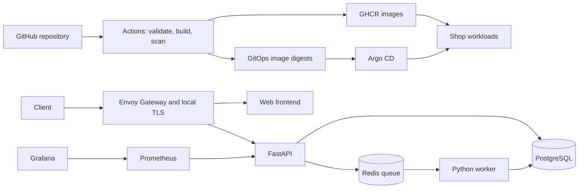
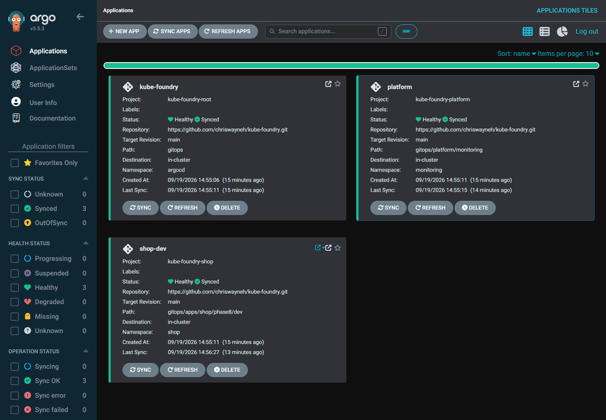
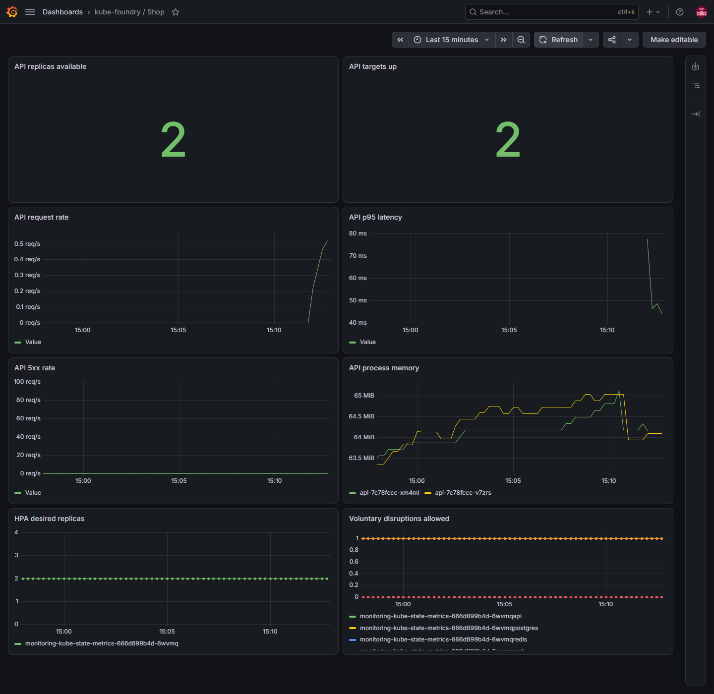

# kube-foundry

A local Kubernetes reference platform for deploying containerized applications, validating platform changes, and testing recovery without cloud infrastructure.

**v1.0.0 is released.** It packages a three-node kind cluster, a small application stack, enforced workload policies, observability, and GitOps delivery. The sample application creates and lists items and processes background jobs. Its purpose is to exercise the platform, not to provide an authenticated commerce service.

[Release v1.0.0](https://github.com/chriswayneh/kube-foundry/releases/tag/v1.0.0) | [Quick start](#run-v10) | [Verification results](docs/release.md#acceptance-record) | [Completed roadmap](docs/phases.md)

## Architecture



Helm bootstraps the platform controllers. Argo CD reconciles the shop application and platform configuration. Cilium enforces default-deny application networking. [Architecture and ownership](docs/architecture.md).

## Run v1.0

Prerequisites: Docker with Linux containers, kind **0.33.0**, kubectl **1.37.0**, Helm **3.22.0**, GNU Make, Python **3.13+**, Git, and curl. Use Bash, WSL, or Git Bash for Make targets. Allow approximately **16 GB of Docker memory** and enough disk space for node images, controller images, and local volumes; this is not a lightweight single-container demo. Internet access is required for GitHub, GHCR, and chart/image registries.

```bash
git clone --branch v1.0.0 https://github.com/chriswayneh/kube-foundry.git
cd kube-foundry
make init-env
make cluster
make install GITOPS_REVISION=v1.0.0
make gateway-access
```

The installer verifies GitOps health, admission/RBAC controls, monitoring, and an HTTPS application smoke test. It uses published image digests; no local image build or registry login is required. The release revision is applied to both the root and child Applications, so installing v1.0 does not silently follow future main-branch changes.

Open **http://shop.localhost:8080** or **https://shop.localhost:8443** while the port-forward runs. HTTPS uses a self-signed local certificate. The smoke test verifies that certificate explicitly. See [host access](docs/traffic.md) and [release operations](docs/release.md) for context selection, existing installations, upgrades, and teardown.

## Included

- FastAPI, Python worker, PostgreSQL, Redis, and a static web frontend
- Persistent volumes, resource limits, startup/liveness/readiness probes
- Cilium network isolation, dedicated service accounts, scoped observer RBAC
- Restricted Pod Security and Kyverno admission policies
- Envoy Gateway routing and cert-manager local TLS
- Helm application packaging and dev/staging/prod configuration examples
- Prometheus, Grafana, CPU autoscaling, and voluntary disruption budgets
- Argo CD reconciliation and SHA-pinned GitHub Actions
- High/critical image vulnerability gates and immutable GHCR digest delivery
- Backup/restore tooling and repeatable recovery exercises

## Screenshots

Actual development-cluster captures, not mockups. [Capture details](docs/release.md#screenshots).





## Verification and operations

```bash
make verify
make grafana-access      # http://127.0.0.1:3000
make argocd-access       # https://127.0.0.1:8081
```

Run port-forward commands in separate terminals. Retrieve generated admin credentials locally as described in [GitOps](docs/gitops.md) and [observability](docs/observability.md). Never put credentials or database dumps in Git.

The release acceptance checks cover a clean three-node install, HTTPS item/job requests, policy enforcement, metrics, failed-image recovery, and restoration of database contents into a separate database. See the [verification record](docs/release.md#acceptance-record), [recovery runbook](docs/recovery.md), and [completed phases](docs/phases.md).

## Scope and limitations

This is a **local reference platform**, not a hosted product or production-ready service. Application endpoints have no user authentication. PostgreSQL, Redis, and the worker are singletons; disruption budgets do not make them highly available. Backups are manual logical database dumps, not scheduled off-cluster protection or Redis queue recovery.

Access stays on loopback. Certificates are self-signed, Metrics Server has a kind-only kubelet TLS exception, and platform controllers retain privileged administrative roles. Automatic pruning is disabled. Staging/prod overlays are examples, not independently operated environments.

Production would require reviewed promotions, trusted TLS and identity, stronger data availability, encrypted off-cluster backups, alerting, and additional controller isolation. Those are optional follow-on projects, not missing v1.0 features.

## Project status

The v1.0 delivery phases are complete. Future enhancements are separated into the [optional backlog](docs/phases.md#optional-post-v10-backlog). [Design decisions](docs/decisions.md), [security model](docs/security.md), and [release notes](docs/releases/v1.0.0.md) document the tradeoffs.

## License

Licensed under the MIT License. Use it, fork it, modify it, or build something of your own. See [LICENSE](LICENSE) for the terms.

---

If this project helped you, a ⭐ is appreciated.
