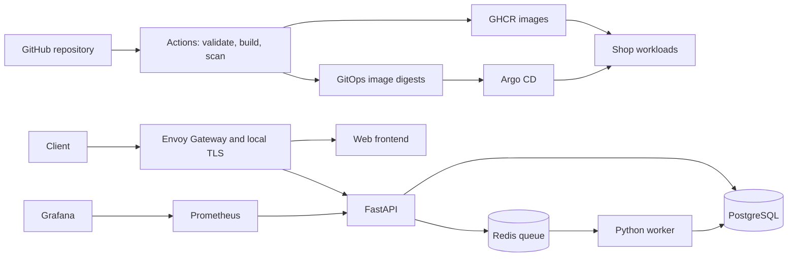
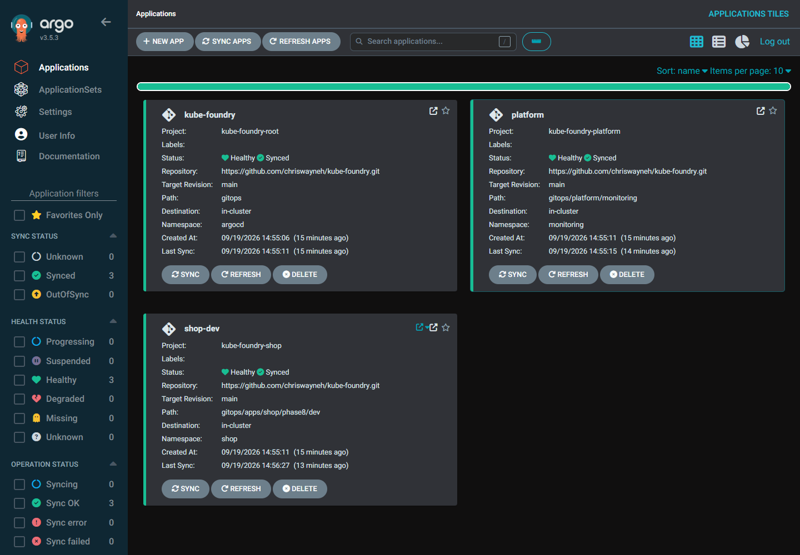
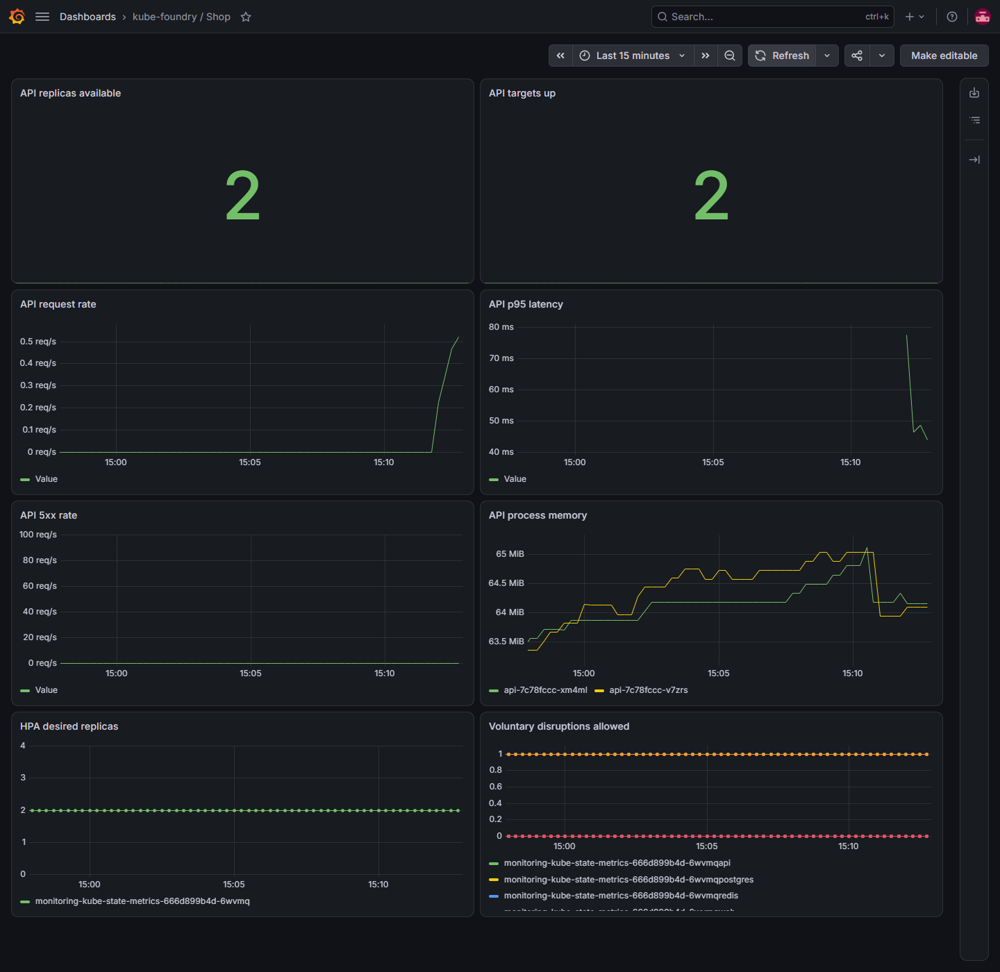

# kube-foundry

A local Kubernetes reference platform for deploying containerized applications, validating platform changes, and testing recovery without cloud infrastructure. It is not a hosted product or a production service.

## Live limits

These match the manifests and the default install path. Feature sections below do not widen them.

- **No application authentication.** Creating and listing items and queueing jobs requires no user identity. The API process also serves `/metrics`, `/docs`, and `/openapi.json` with no credentials. The Gateway routes only `/api` to that process; anything allowed to open TCP port 8000 can call the rest.
- **Not highly available.** PostgreSQL, Redis, and the worker are single replicas. Backups are manual logical database dumps, not scheduled off-cluster protection or Redis queue recovery. There is no paging. Staging and prod overlays are configuration examples, not separate operated environments.
- **Loopback is the supported application path. The default kind file is not loopback-only.** `make gateway-access` binds `127.0.0.1`. `clusters/kind/cluster.yaml` publishes host ports 80 and 443 and does not set `listenAddress`, so [kind binds all interfaces](https://kind.sigs.k8s.io/docs/user/configuration/) (`0.0.0.0`). The shop Gateway Service is ClusterIP and is not attached to those host ports. `clusters/kind/verification.yaml` omits the mappings.
- **TLS stops at the local Gateway.** The certificate is self-signed, and HTTP is served as well as HTTPS with no redirect. PostgreSQL and Redis are not configured for TLS (`postgres:17.11-alpine3.24` with no certificates; Redis is `requirepass` only), so queries and passwords cross the pod network in the clear. Metrics Server is started with `--kubelet-insecure-tls` for kind's kubelet certificates.
- **Default-deny is the `shop` namespace, not the cluster.** Cilium enforces the NetworkPolicies in that namespace. Restricted Pod Security and the Kyverno policies are also scoped to `shop`. Envoy, Argo CD, monitoring, Kyverno, and `kube-system` are not default-deny. Platform controllers keep the broad privileges from their charts.
- **Acceptance records are operator exercises, not an independent review.** The v1.0 and v1.1 notes describe checks run on a local kind cluster. This repository does not claim a third-party security review, penetration test, or certification.

**v1.1.0** adds a Git-backed promotion and rollback exercise, a policy-remediation dry-run, and checksum-linked recovery evidence on the three-node kind platform. The sample application creates and lists items and processes background jobs. Its purpose is to exercise the platform, not to provide an authenticated service.

[Release v1.1.0](https://github.com/chriswayneh/kube-foundry/releases/tag/v1.1.0) | [Quick start](#run-v11) | [Operational proof](docs/operational-proof.md) | [Roadmap](docs/phases.md)

## Architecture


```mermaid
flowchart LR
    Git[GitHub repository] --> CI[Actions: validate, build, scan]
    CI --> Images[GHCR images]
    CI --> Desired[GitOps image digests]
    Desired --> Argo[Argo CD]
    Argo --> Shop[Shop workloads]
    Images --> Shop
    Client --> Gateway[Envoy Gateway and local TLS]
    Gateway --> Web[Web frontend]
    Gateway --> API[FastAPI]
    API --> PG[(PostgreSQL)]
    API --> Redis[(Redis queue)]
    Redis --> Worker[Python worker]
    Worker --> PG
    Prom[Prometheus] --> API
    Grafana --> Prom
```

Helm bootstraps the platform controllers. Argo CD reconciles the shop application and platform configuration. Cilium enforces default-deny networking in the `shop` namespace. [Architecture and ownership](docs/architecture.md).

## Run v1.1

Prerequisites: Docker with Linux containers, kind **0.33.0**, kubectl **1.37.0**, Helm **3.22.0**, GNU Make, Python **3.13+**, Git, and curl. Use Bash, WSL, or Git Bash for Make targets. Allow approximately **16 GB of Docker memory** and enough disk space for node images, controller images, and local volumes; this is not a lightweight single-container demo. Internet access is required for GitHub, GHCR, and chart/image registries.

```bash
git clone --branch v1.1.0 https://github.com/chriswayneh/kube-foundry.git
cd kube-foundry
make init-env
make cluster
make install GITOPS_REVISION=v1.1.0
make gateway-access
```

The installer verifies GitOps health, admission/RBAC controls, monitoring, and an HTTPS application smoke test. It uses published image digests; no local image build or registry login is required. The release revision is applied to both the root and child Applications, so installing a release does not silently follow future main-branch changes.

Open **http://shop.localhost:8080** or **https://shop.localhost:8443** while the port-forward runs. HTTPS uses a self-signed local certificate. The smoke test verifies that certificate explicitly. See [host access](docs/traffic.md) and [release operations](docs/release.md) for context selection, existing installations, upgrades, and teardown.

## Included

- FastAPI, Python worker, PostgreSQL, Redis, and a static web frontend
- Persistent volumes, resource limits, startup/liveness/readiness probes
- Cilium network isolation, dedicated service accounts, scoped observer RBAC
- Restricted Pod Security and Kyverno admission policies
- Envoy Gateway routing and cert-manager local TLS
- Helm application packaging and dev/staging/prod configuration examples
- Prometheus, Grafana, CPU autoscaling, and voluntary disruption budgets
- Argo CD reconciliation and SHA-pinned GitHub Actions
- High/critical image vulnerability gates and immutable GHCR digest delivery
- Backup/restore tooling and repeatable recovery exercises

On this development branch, [local reliability signals](docs/observability.md#local-reliability-signals-unreleased)
add Prometheus rules and two dashboard panels. They are unreleased and await live cluster acceptance.

## Zero-trust principles and trust boundaries

The platform applies zero-trust principles to application networking and workload permissions. Running inside the cluster does not by itself grant access to another workload or the Kubernetes API.

- **Explicit network paths in `shop`:** Cilium enforces default-deny ingress and egress in that namespace, with documented allowances for required traffic. Other namespaces are not covered.
- **Least-privilege identities:** workload service accounts have no RoleBindings and do not mount API tokens. The namespace-scoped observer cannot read Secrets, exec into Pods, or change workloads.
- **Enforced workload constraints:** restricted Pod Security and Kyverno admission policies constrain what can run, alongside non-root execution and dropped capabilities.
- **Operator evidence:** policy checks exercise allowed and denied operations. Release notes record what was run locally. That is not an independent review.

This is not a complete zero-trust architecture: application endpoints have no user authentication, and the workstation, Docker daemon, control plane, and privileged platform administrators remain trusted. Local TLS does not provide application identity. See the [security model](docs/security.md), [policy checks](policy/README.md), and [release limitations](docs/release.md#release-contract).

## Screenshots

Actual development-cluster captures from v1.0 on 2026-09-19, not mockups. The interfaces are unchanged; v1.1 operational evidence is linked in the [walkthrough](docs/operational-proof.md#acceptance-record). [Capture details](docs/release.md#screenshots).





## Verification and operations

```bash
make verify
make grafana-access      # http://127.0.0.1:3000
make argocd-access       # https://127.0.0.1:8081
```

Run port-forward commands in separate terminals. Retrieve generated admin credentials locally as described in [GitOps](docs/gitops.md) and [observability](docs/observability.md). Never put credentials or database dumps in Git.

The release acceptance checks cover a clean three-node install, HTTPS item/job requests, policy enforcement, metrics, failed-image recovery, and restoration of database contents into a separate database. See the [verification record](docs/release.md#acceptance-record), [recovery runbook](docs/recovery.md), and [completed phases](docs/phases.md).

## Scope and limitations

The [live limits](#live-limits) are the support boundary. Automatic pruning is also disabled, so removing a manifest from Git does not delete the live object. The workstation, Docker daemon, kind control plane, and platform administrators are trusted.

A production deployment would still need identity, trusted certificates, encrypted data stores, stronger data availability, encrypted off-cluster backups, alerting, controller isolation, and a promotion process that has actually been reviewed. Those are follow-on projects. This repository does not provide them.

## Project status

The v1.0 platform and v1.1 operational-proof milestones are complete. Future enhancements are separated into the [optional backlog](docs/phases.md#optional-post-v10-backlog). [Design decisions](docs/decisions.md), [security model](docs/security.md), [changelog](CHANGELOG.md), and [release notes](docs/releases/v1.1.0.md) document the tradeoffs.

## License

Licensed under the MIT License. Use it, fork it, modify it, or build something of your own. See [LICENSE](LICENSE) for the terms.

---

If this project helped you, a ⭐ is appreciated.
