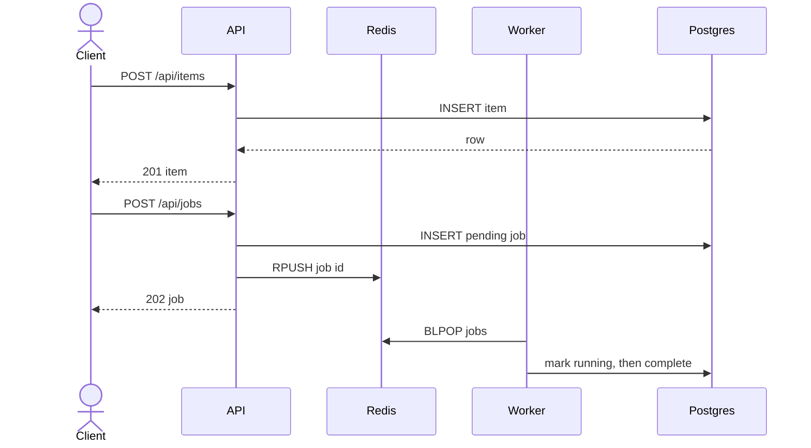

# Architecture

## Current system (phase 3)

The `shop` namespace contains four deployed workloads. The API is stateless. PostgreSQL is a single-replica StatefulSet with a stable network identity and PVC. Redis is a single-replica Deployment with a PVC. The worker blocks on the Redis `jobs` list and records job state in PostgreSQL.

## Kubernetes object relationships

A Pod is the smallest scheduled unit and contains one or more containers. Pods are disposable and receive new names and IP addresses when replaced. A ReplicaSet keeps a requested number of matching Pods running. A Deployment owns ReplicaSets and adds declarative rollout and rollback behavior. In this project, the `api` Deployment owns its ReplicaSet; operators change the Deployment and never manage its Pods directly.

Services provide stable discovery over changing Pods. The `postgres` headless Service also gives the StatefulSet a stable network identity. PersistentVolumeClaims decouple PostgreSQL and Redis data from Pod lifetimes.

## Health semantics

- `/healthz` proves the API process can serve HTTP; Kubernetes uses it for startup and liveness.
- `/readyz` checks required configuration and, from phase 3 onward, executes PostgreSQL and Redis pings. Any failed dependency returns HTTP 503, removing the Pod from Service endpoints.
- Schema creation is idempotent and runs on API and worker startup only when dependency checks are enabled.

## Image flow

Local images carry the immutable development tag `0.1.0`. `imagePullPolicy: IfNotPresent` allows kind-loaded images and never resolves `:latest`. A future release pipeline will replace the tag in GitOps overlays with a commit-derived tag or digest.

