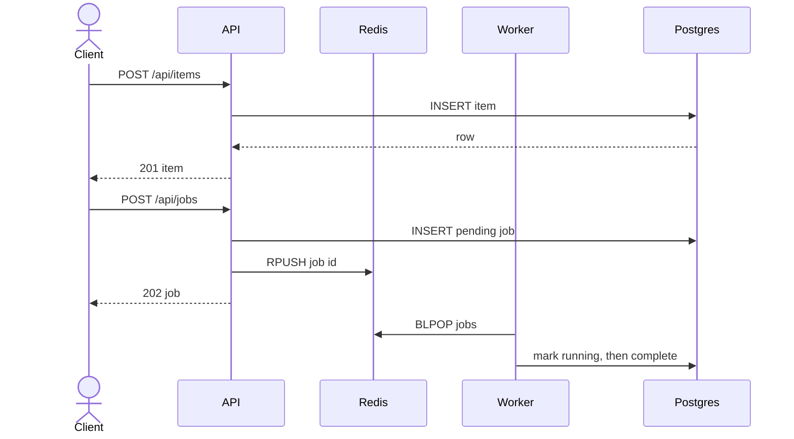

# Architecture

## Current system (phase 7)

The `shop` namespace contains five deployed workloads: web, API, worker, PostgreSQL, and Redis. The API is stateless. PostgreSQL is a single-replica StatefulSet with a stable network identity and PVC. Redis is a single-replica Deployment with a PVC. The worker blocks on the Redis `jobs` list and records job state in PostgreSQL.

Envoy Gateway manages a proxy in `envoy-gateway-system`. A Gateway and HTTPRoute in `shop` expose the frontend and API under `shop.localhost`, with `/api` taking precedence over `/`. Paths are preserved because FastAPI already serves `/api`. Both HTTP and HTTPS listeners use the same routes. cert-manager maintains the TLS Secret from a namespaced self-signed Issuer and Certificate.

The proxy Service is ClusterIP. A loopback port-forward exposes HTTP on 8080 and HTTPS on 8443 without a host-network Pod or external load balancer. NetworkPolicy allows only this Gateway's proxy Pods in `envoy-gateway-system` to reach the API and web ports. The frontend makes API requests from the browser, so its Pod needs no API or database egress. See [traffic configuration](traffic.md).

## Kubernetes object relationships

Every application workload has a dedicated ServiceAccount with token automount disabled and no Kubernetes API grants. A separate observer RoleBinding permits status and log reads only within `shop`. The namespace enforces restricted Pod Security v1.37. Kyverno's namespaced CEL policies reject noncompliant Pods and controller templates before admission; a separate policy covers ephemeral-container updates. The Kyverno controller runs in its own namespace. See [security controls](security.md).

A Pod is the smallest scheduled unit and contains one or more containers. Pods are disposable and receive new names and IP addresses when replaced. A ReplicaSet keeps a requested number of matching Pods running. A Deployment owns ReplicaSets and adds declarative rollout and rollback behavior. In this project, the `api` Deployment owns its ReplicaSet; operators change the Deployment and never manage its Pods directly.

Services provide stable discovery over changing Pods. The `postgres` headless Service also gives the StatefulSet a stable network identity. PersistentVolumeClaims decouple PostgreSQL and Redis data from Pod lifetimes.

## Health semantics

Prometheus discovers API metrics through a ServiceMonitor and an explicit network-policy allowance. Grafana provisions a dashboard from Git. Metrics Server supplies CPU utilization to the API HPA; phase 7 overlays omit API replicas so deployment reconciliation does not compete with autoscaling. Five PodDisruptionBudgets govern voluntary evictions. See [observability and scaling](observability.md) for access and availability limits.

- `/healthz` proves the API process can serve HTTP; Kubernetes uses it for startup and liveness.
- `/readyz` checks required configuration and, from phase 3 onward, executes PostgreSQL and Redis pings. Any failed dependency returns HTTP 503, removing the Pod from Service endpoints.
- Schema creation is idempotent and runs on API and worker startup only when dependency checks are enabled.

## Image flow

`charts/shop` packages the application resources. `make render-shop` produces the committed Kustomize base, and `make check-chart` checks it for drift. Dev, staging, and prod overlays adjust stateless replica counts, API requests, hostnames, and explicit image tags. Each environment runs in a separate cluster with the same namespace and resource names. Platform controllers and GatewayClass are installed independently; runtime Secrets are never rendered into Git.

Local images carry the immutable development tag `0.1.0`. `imagePullPolicy: IfNotPresent` allows kind-loaded images and never resolves `:latest`. A future release pipeline will replace the tag in GitOps overlays with a commit-derived tag or digest.
